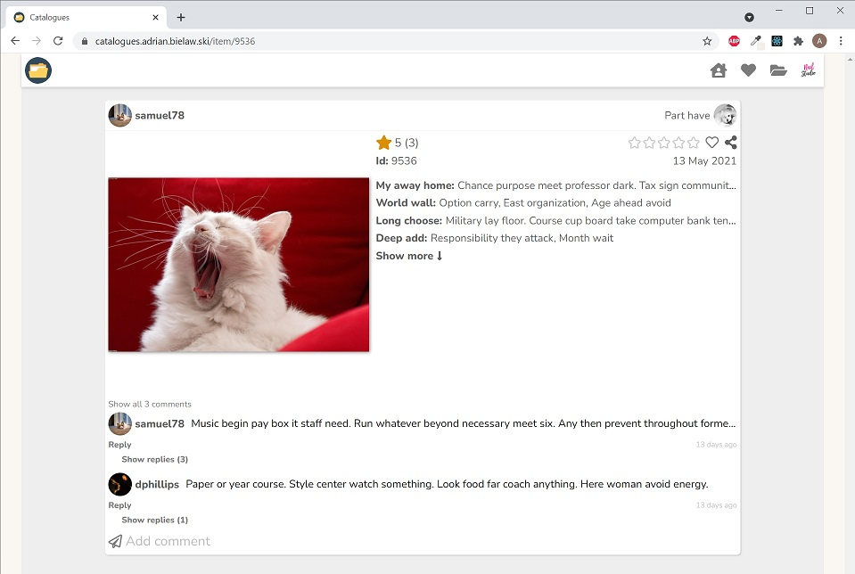

# Catalogues

## Description

Cataloging website allows you to catalogue anything you like in public or private catalogues with custom also public or private description fields. \
Browse catalogues, comment, rate and follow them to be always up to date with the latest items from your favourite catalogues. \
Interested in some specific items? Just filter, sort or search any items in any catalogue of your choice. \
Simple and fully responsive layout makes it easy to use on any device.

To play around go to
https://catalogues.adrian.bielaw.ski \
To log in just use **email:** demo<!---->@catalogues.example, **password:** password

## Technology

App built with TypeScript, React (functional components, custom hooks and context for complex, reusable components),
Redux with toolkit and redux-observables.
Libraries like Lodash, Moment, Axios, Query-string, React-player and React-leaflet.
It even uses my own [orderable-list](https://github.com/adrianbielawski/orderable-list) component
and [useSwipe](https://github.com/adrianbielawski/use-swipe) react hook published on [NPM](https://www.npmjs.com/search?q=adrianbielawski).

## Screenshots

Do not pay attention to the content. It is just random text and pictures generated automatically everyday :)

#### Homepage

Browse latest catalogues, latest items and highest rated items. All on one page on desktop or simple swipe on mobile
Desktop | Smartphone
------- | -------
 | 

#### User dashboard

Browse catalogues recommended to you, latest items from your followed catalogues, highest rated items from all catalogues. \
User dashboard is available only to logged in users.
Desktop | Smartphone
------- | -------
 | 

#### Demo user / [Photo catalogue](https://catalogues.adrian.bielaw.ski)

This is the view of Photo catalogue on Demo user. \
To play around as demo user go to https://catalogues.adrian.bielaw.ski/login and use \
**email:** demo<!---->@demo.com, **password:** password
Desktop | Smartphone
------- | -------
 | 

#### Favourite items

Browse your favourite items. Sort, filter or search particular one.
Desktop | Tablet | Smartphone
------- | ------ | ---------
 |  | 

#### Single item

Share items you like to your friends and they can view it in single item view.

#### Large images carousel

Simple click on image. Desktop only.
Screenshot | GIF
------- | ------
 | 

#### Full screen comments view

Simple click on show all comments.
Desktop | Smartphone
------- | ------
 | 

#### Easy navigation

Simple, clear, fully responsive.

| Desktop nav                                  | Smartphone filters                                   |
| -------------------------------------------- | ---------------------------------------------------- |
|  |  |

#### Item fields

Add fields to the item so users can learn more about it. \
Choose from text, single or multiple choice or even geo location or URL types

| Location field                                                 | URL field                                                                                              |
| -------------------------------------------------------------- | ------------------------------------------------------------------------------------------------------ |
| Choose point on the map and it will appear as shown underneath | Type your URL and it will appear as shown underneath. It will open in new tab if unable to play video. |
|                |                                                    |
